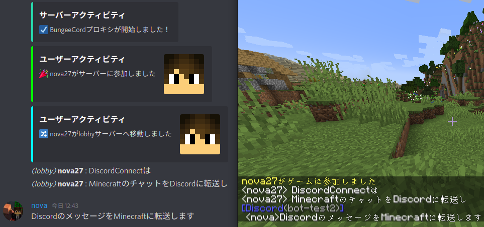

[](https://github.com/nova-27/DiscordConnect/releases)
[](https://github.com/nova-27/DiscordConnect/blob/master/LICENSE)

# DiscordConnect
このBungeeCordプラグインは、DiscordとMinecraftのチャットを連携します。

## デモ


## 特徴
- メッセージをDiscordとMinecraftで相互に転送します
- プレイヤーやサーバーの行動を、埋め込みメッセージで表示します
- 他のプラグインと連携します（現在は [LunaChat](https://github.com/ucchyocean/LunaChat) のみ）

## 統計
[](https://bstats.org/plugin/bungeecord/DiscordConnect/)

## 導入
[wiki](https://github.com/nova-27/DiscordConnect/wiki) を参照してください

## ビルド
1. ソースコードをダウンロードします
```shell
git clone https://github.com/nova-27/DiscordConnect.git
```
2. `libs`ディレクトリに最新の [LunaChat.jar](https://github.com/ucchyocean/LunaChat/releases) を追加します
3. ビルドします
```shell
cd DiscordConnect
./gradlew shadowJar
```
4. `build/libs`ディレクトリにプラグインjarが生成されます

## ライセンス
当リポジトリは [Apache-2.0 License](http://www.apache.org/licenses/) のもとで公開されています

## 作者
[nova27](https://github.com/nova-27)

`libs`に含まれる`MarkdownConverter`と`N8ChatCaster-dummy`は以下の方の成果物で、特別に許可を頂いて再頒布しています  
[Necnion8](https://github.com/Necnion8)